# Automated AWS ECS Infrastructure & CI/CD Pipeline

This document contains a comprehensive visual overview of the entire deployment pipeline and the final AWS ECS architecture we have built together for the Global PRS API.

> [!NOTE]
> All resource names, account IDs, and specific naming conventions have been anonymized in this repository for security and privacy reasons while maintaining the functional architecture.

## How It Works (The 2 Pipelines)

### 1. The Infrastructure Flow (Right Side Flow)
1. You make a change to the CDK code on your laptop (e.g., resizing to a larger EC2 instance).
2. You run `git push` to upload the code to GitHub.
3. GitHub Actions triggers [`cdk-deploy.yml`](https://github.com/KrishnaaCloud/aws-ecs-devops-cdk-stack/blob/39f87d8eadca44ddd489b7aebeb7c5ffd2041657/Workflows/cdk-deploy.yml)
4. It secretly logs into AWS without passwords using the `OIDC` trust relationship.
5. It runs `cdk deploy` safely on AWS CloudFormation to update your subnets, ASG, Load Balancer, or Security Groups in the background.

### 2. The Application Flow (Left Side Flow)
1. The developer writes code for the actual Python API and commits it.
2. GitHub Actions triggers [`continuous-integration.yml`](https://github.com/KrishnaaCloud/aws-ecs-devops-cdk-stack/blob/6a6fa3266b77bd055b856e673533cfa62e38976b/Workflows/ci.yml) to build the Docker Image.
3. The image is saved in AWS ECR.
4. The pipeline triggers [`continuous-deployment.yml`](https://github.com/KrishnaaCloud/aws-ecs-devops-cdk-stack/blob/6a6fa3266b77bd055b856e673533cfa62e38976b/Workflows/cd.yml), which talks strictly to the ECS Service.
5. ECS gracefully restarts the 4 existing tasks using the Zero-Downtime strategy to pull down the newly updated image.
6. When the new tasks start up, they dynamically pull the database passwords seamlessly out of AWS Secrets Manager using the `ecs-user` IAM Access Keys we secretly injected into the Task Definition environment!
